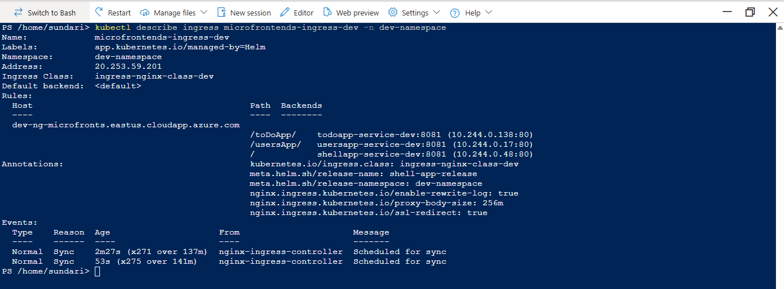
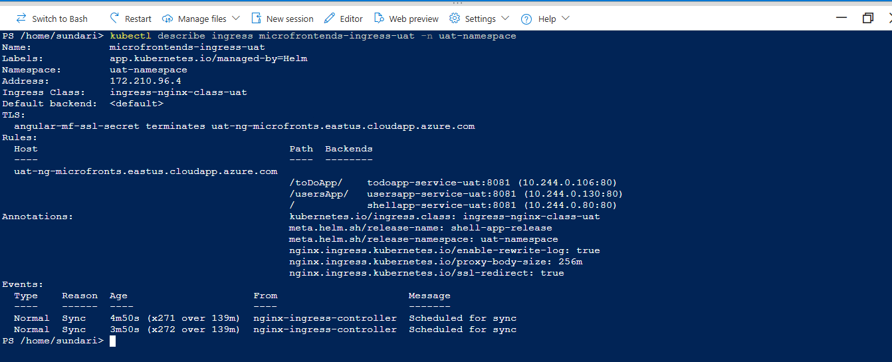
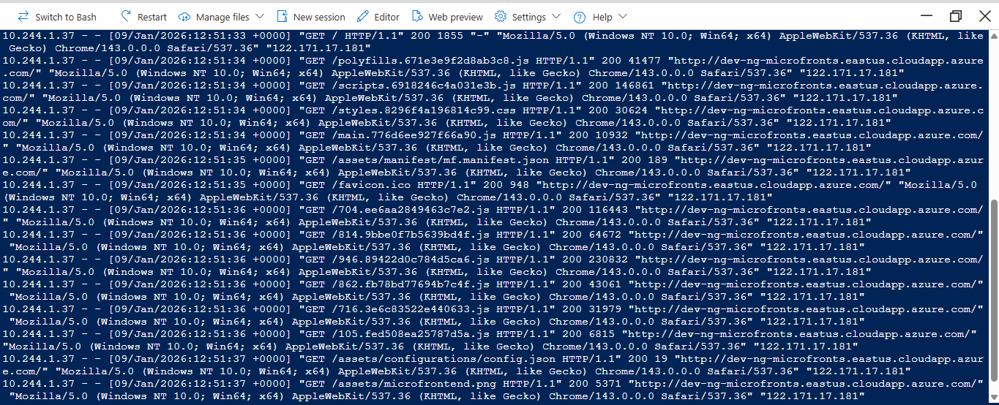
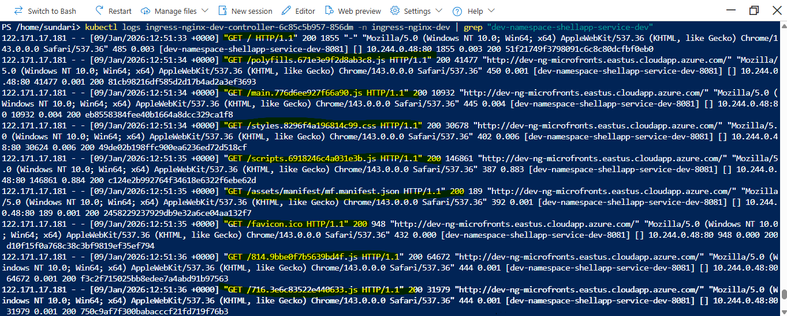
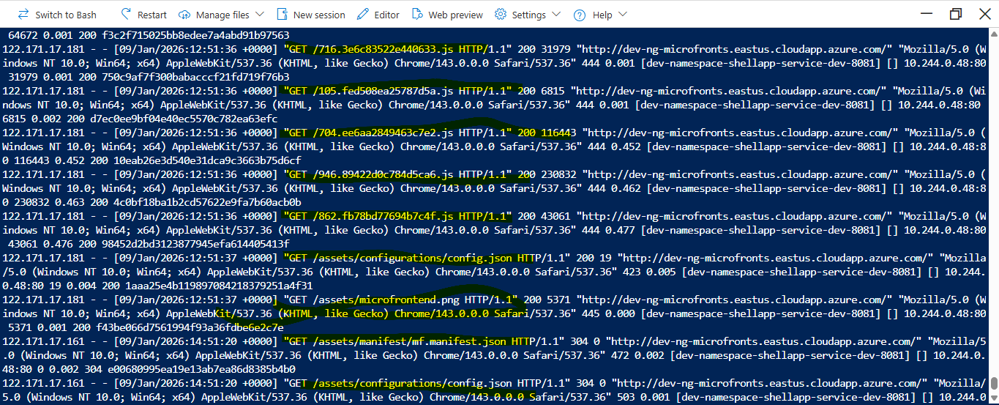
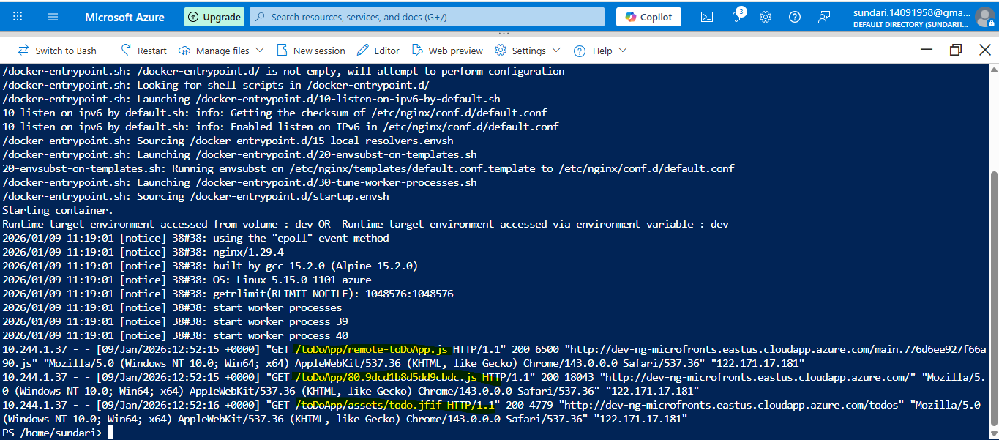
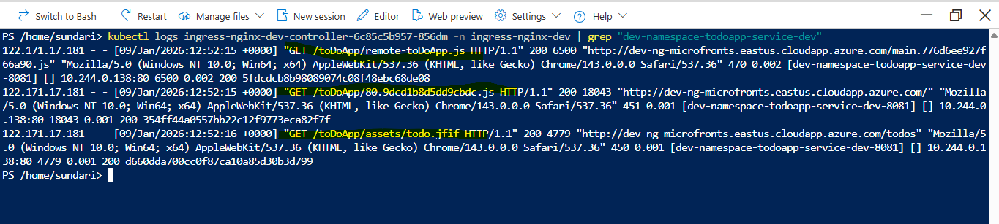
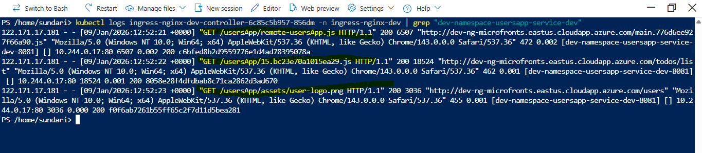

https://github.com/angular-architects/module-federation-plugin/blob/main/libs/mf/tutorial/tutorial.md

C:\Users\User\angular\microfrontends\module-federation-updated>ng new shell-application

C:\Users\User\angular\microfrontends\module-federation-updated\shell-application>ng add @angular-architects/module-federation@"^16.0.4" --port 5004
i Using package manager: npm
√ Package information loaded.

The package @angular-architects/module-federation@^16.0.4 will be installed and executed.
Would you like to proceed? Yes
√ Packages successfully installed.
? Project name (press enter for default project) shell-application
CREATE webpack.config.js (1604 bytes)
CREATE webpack.prod.config.js (46 bytes)
CREATE src/bootstrap.ts (214 bytes)
UPDATE tsconfig.json (823 bytes)
UPDATE tsconfig.app.json (185 bytes)
UPDATE angular.json (2694 bytes)
UPDATE package.json (1238 bytes)
UPDATE src/main.ts (58 bytes)
√ Packages installed successfully.

C:\Users\User\angular\microfrontends\module-federation-updated\shell-application>

---------------------------------------------------------------------------------------------------------

All data(IP's, clusters etc) related to this project has been deleted. Nothing exists now. Just a documentation on how the elements
interact.

# How to run the project using DockerDesktop and Kubernetes

Ensure you have DockerDesktop running and Kubernetes is enabled.

So we have a shell microfrontend, a todo microfrontend and a users microfrontend.
We will load the shell app and then lazily load the other 2 based on tab selection.

Each microfrontend(MF) will have 3 environments: dev, uat and prod.

All the 3 microfrontends will be deployed to a single kubernetes cluster but the environments will be differentiated
based on namespace.
So we will have a dev-namespace, uat-namespace and a prod-namespace within the cluster.
Assuming we have only single replica of each microfrontend, there will be 3 pods running in each namespace.
3 pods for the 3 microfrontends.

```
C:\Users\User>kubectl get pods -n dev-namespace
NAME                                                              READY   STATUS    RESTARTS   AGE
angular-shell-app-module-federation-deployment-dev-6c75965qswzt   1/1     Running   0          89s
angular-todo-app-module-federation-deployment-dev-57895f5c5csf5   1/1     Running   0          80s
angular-users-app-module-federation-deployment-dev-56798cdcv2xv   1/1     Running   0          33m

C:\Users\User>kubectl get pods -n uat-namespace
NAME                                                              READY   STATUS    RESTARTS   AGE
angular-shell-app-module-federation-deployment-uat-d6b88ffd7tnj   1/1     Running   0          45s
angular-todo-app-module-federation-deployment-uat-84d7bcdf2cqns   1/1     Running   0          75s
angular-users-app-module-federation-deployment-uat-78495ffhlnf2   1/1     Running   0          22m

C:\Users\User>kubectl get pods -n prod-namespace
NAME                                                              READY   STATUS    RESTARTS   AGE
angular-shell-app-module-federation-deployment-prod-846ff8bkrkg   1/1     Running   0          48s
angular-todo-app-module-federation-deployment-prod-7c945c9xzl4b   1/1     Running   0          71s
angular-users-app-module-federation-deployment-prod-7584d742fz7   1/1     Running   0          22m

C:\Users\User>

```

Use "kubectl logs <pod-name> -n <namespace-name>" to get the nginx container logs for a  particular namespace.

To shell into a pod, use the below command:

```
kubectl exec -it <pod-name> -n <namespace-name> -- /bin/sh
```

The pods for each MF will be fronted by a ClusterIP type service. The service will run on port 8081 for all environments for all MF's.
There is no need for different ports for different MF's and different environments.
But it is very important that the service names are unique for each MF. So the service name and port combination must be unique for a service
in each MF.

We will also have an Ingress Controller in front of the ClusterIP service running on port 80 by default, again in all environments
for all MF's. You cannot change this port. It will be 80 for http and 443 for SSL.

So all client requests in the browser will be forwarded to Ingress Controller on port 80
From Ingress Controller ---> ClusterIP service on port 8081
From Cluster IP service ----> Nginx container running inside the pod, listening on port 80.

We will define the Ingress Controller only for shell MF because that will loaded in the browser by the user.
This way, the browser never talks directly to the remotes — only the shell does, inside the cluster.

Now how does the Ingess for shell app in dev env has to forward the requests to the clusterip service for the shell MF in the same namespace ?
We will do it based on the host field in the ingress.yaml. 

In the /etc/hosts file in windows, I have defined the below 3 mappings- one for each environment.

127.0.0.1       dev-angular-mf
127.0.0.1       uat-angular-mf
127.0.0.1       prod-angular-mf

In the ingress.yaml, based on the host field the ingress controller will forward the requests
to the clusterIP service for the correct MF in the correct namespace.
{{.Values.hosName}} picked from values.yaml wil be angular-mf
{{.Values.environment}} will be dev,uat or prod. It will be picked from the "helm upgrade" command.
In values.yaml, the value of environment is "". It is updated dynamically in the "helm upgrade" command.

```
rules:
    - host: {{.Values.environment}}-{{.Values.hostName}}
```

I will access the dev shell MF on http://dev-angular-mf:8082/
I will access the uat shell MF on http://uat-angular-mf:8083/
I will access the prod shell MF on http://prod-angular-mf:8084/


Now you may think, if Ingress is running on port 80, why have we mentioned port 8082/8083/8084 in the above urls ?

Before we get to that, lets understand how to install Ingress Controller using helm

## Ingress Nginx Controller vs Nginx Container running in the pod

### 🔹 What Ingress Handles
- **Ingress is only a router.**
- It looks at the **host** (`dev-angular-mf`) and **path** (`/`, `/toDoApp/`, `/usersApp/`, `/` etc.).
- Based on your Ingress rules, it forwards the request to the correct **Cluster IP Service**.
- It does not serve files itself, nor does it know about `index.html` or Angular bundles.


### 🔹 What Nginx in Your Pod Handles
- Once the request reaches your Pod, **Nginx inside the container** decides how to serve content.
- Typical config:
  ```nginx
  location / {
      root /usr/share/nginx/html;
      index index.html;
  }
  ```
  → This is what makes `/` return `index.html`.
- For static assets (`main.js`, `styles.css`, etc.), Nginx serves them directly from the filesystem.
- If you need SPA fallback (Angular routing), you add:
  ```nginx
  location / {
      try_files $uri /index.html;
  }
  ```
  → Ensures Angular routes like `/users` still load `index.html`.

### 🔹 Division of Responsibility
- **Ingress**: Decides *which Service* gets the request based on host/path.
- **Service**: Forwards traffic to the right Pod port.
- **Nginx in Pod**: Serves `index.html`, JS bundles, assets, and handles Angular’s client‑side routing.

Yes — Ingress only handles routing between host/path → ClusterIP Service which then forwards the request to the pod. Everything about serving `index.html`, JS bundles, MIME types, and Angular route fallback must be configured in the **Nginx inside your Pod**.  


## Ingress Nginx Controller vs Ingress Nginx Resource

The **Ingress Controller** (`ingress-nginx-controller`) is the “brain” that reads all `Ingress` resources in the cluster.  
Your **Ingress Resource** (`microfrontends-ingress`) in the ingress-resource.yaml file is one of those resources.  

The controller sees your rules (`/users → users-service`, `/todo → todo-service`, `/ → shell-app`) and programs its internal NGINX instance accordingly.  

1. **Ingress Controller (ingress‑nginx‑controller)**  
   - This is the **actual software** (NGINX pods + Service) that runs inside your cluster.  
   - It watches for `Ingress` resources and translates them into NGINX routing rules.  
   - It’s exposed via a Service (usually `LoadBalancer` or `NodePort`) so traffic from outside the cluster can reach it.  
   - Think of it as the **router engine**.

2. **Ingress Resource (microfrontends‑ingress)**  
   - This is the **configuration object** you wrote in YAML.  
   - It defines **rules**: hostnames, paths, and which backend ClusterIP Services they should route to.  
   - It doesn’t expose anything by itself — it’s just instructions.  
   - Think of it as the **routing table**.

- **Ingress Controller** = the **traffic cop** standing at the cluster’s entrance.  
- **Ingress Resource** = the **map of rules** telling the cop:  
  - “Cars going to `/users` → send them to the Users service.”  
  - “Cars going to `/todo` → send them to the Todo service.”  
  - “Cars going to `/` → send them to the Shell app.”

Without the controller, the rules are just paper — nothing enforces them. Without the rules, the controller has no instructions.

## How to install Ingress Nginx Controller in local setup

We have installed 3 ingress controllers for the 3 environments

To install the Ingress Controller, we follw the below steps.

### First uninstall if anything already installed. if not ignore

```
kubectl delete svc ingress-nginx-controller -n ingress-nginx
helm uninstall ingress-nginx -n ingress-nginx
```

### 🔹 Add the Ingress‑NGINX Helm Repo
```
helm repo add ingress-nginx https://kubernetes.github.io/ingress-nginx
helm repo update
```

### 🔹 Install Ingress‑NGINX Controller

```
Below is for dev

helm install ingress-nginx-dev ingress-nginx/ingress-nginx --namespace ingress-nginx-dev --create-namespace --set controller.ingressClass=ingress-nginx-class-dev --set controller.ingressClassResource.name=ingress-nginx-class-dev --set controller.watchNamespace=dev-namespace --set controller.service.name=ingress-nginx-dev-controller

- `ingress-nginx-dev` → release name  
- `ingress-nginx/ingress-nginx` → chart name  
- `--namespace ingress-nginx-dev` → deploys into its own namespace  
- `--create-namespace` → creates the namespace if it doesn’t exist 

Below is for uat

helm install ingress-nginx-uat ingress-nginx/ingress-nginx --namespace ingress-nginx-uat --create-namespace --set controller.ingressClass=ingress-nginx-class-uat --set controller.ingressClassResource.name=ingress-nginx-class-uat --set controller.watchNamespace=uat-namespace --set controller.service.name=ingress-nginx-uat-controller

Below is for prod

helm install ingress-nginx-prod ingress-nginx/ingress-nginx --namespace ingress-nginx-prod --create-namespace --set controller.ingressClass=ingress-nginx-class-prod --set controller.ingressClassResource.name=ingress-nginx-class-prod --set controller.watchNamespace=prod-namespace --set controller.service.name=ingress-nginx-prod-controller

```

### 🔹 Verify Installation

We are doing it for 3 environments using "kubectl get svc" and "kubectl get pods"

"kubectl get svc" gives the details on the ingress controller name
"kubectl get pods" gives the details on the ingress controller pods.

We use the pod name to get the controller logs.

```

C:\Users\User>kubectl get svc -n ingress-nginx-dev
NAME                                     TYPE           CLUSTER-IP      EXTERNAL-IP   PORT(S)                      AGE
ingress-nginx-dev-controller             LoadBalancer   10.96.224.132   A.B.C.D    80:30435/TCP,443:30387/TCP   2m58s
ingress-nginx-dev-controller-admission   ClusterIP      10.96.252.68    <none>        443/TCP                      2m58s

C:\Users\User>kubectl get pods -n ingress-nginx-dev
NAME                                            READY   STATUS    RESTARTS   AGE
ingress-nginx-dev-controller-7b6d9b847d-gz762   1/1     Running   0          19m

C:\Users\User>


C:\Users\User>kubectl get svc -n ingress-nginx-uat
NAME                                     TYPE           CLUSTER-IP      EXTERNAL-IP   PORT(S)                      AGE
ingress-nginx-uat-controller             LoadBalancer   10.96.160.122   <pending>     80:32478/TCP,443:32078/TCP   2m21s
ingress-nginx-uat-controller-admission   ClusterIP      10.96.185.255   <none>        443/TCP                      2m21s

C:\Users\User>kubectl get pods -n ingress-nginx-uat
NAME                                            READY   STATUS    RESTARTS   AGE
ingress-nginx-uat-controller-5dbdb4b5c8-znk77   1/1     Running   0          20m

C:\Users\User>kubectl get svc -n ingress-nginx-prod
NAME                                      TYPE           CLUSTER-IP     EXTERNAL-IP   PORT(S)                      AGE
ingress-nginx-prod-controller             LoadBalancer   10.96.20.28    <pending>     80:32558/TCP,443:31407/TCP   103s
ingress-nginx-prod-controller-admission   ClusterIP      10.96.11.241   <none>        443/TCP                      103s

C:\Users\User>kubectl get pods -n ingress-nginx-prod
NAME                                             READY   STATUS    RESTARTS   AGE
ingress-nginx-prod-controller-5b4c57fdd6-vqj6b   1/1     Running   0          19m

C:\Users\User>

```

The EXTERNAL-IP might be pending in DockerDesktop. It does not matter because you are going to port-forward.

You’ll see an EXTERNAL-IP assigned when you set the Service type to LoadBalancer, but it’s not actually routable from outside your machine. Here’s why the External IP Isn’t Reachable:

Docker Desktop doesn’t have a real cloud load balancer integration.
When you request type: LoadBalancer, Kubernetes fakes it by assigning an IP from the internal cluster network (usually from the 10.x.x.x range).
That IP exists inside the Docker VM, not on your host machine’s network.
So your browser on the host can’t reach it directly — it’s only valid inside the cluster.

To make ingress-nginx-controller work with Docker desktop, need to port-forward using the below command.
Execute the below 3 commands in 3 CMD windows.

```
kubectl port-forward svc/ingress-nginx-dev-controller -n ingress-nginx-dev 8082:80
kubectl port-forward svc/ingress-nginx-uat-controller -n ingress-nginx-uat 8083:80
kubectl port-forward svc/ingress-nginx-prod-controller -n ingress-nginx-prod 8084:80

```

The first number (8082,8083 or 8084) is the local port on your machine. It needs to be unique.

You’re telling Kubernetes:

“Expose port 80 of the Service ingress-nginx-dev-controller to my local machine on port 8082 for dev”
“Expose port 80 of the Service ingress-nginx-uat-controller to my local machine on port 8083 for uat”
“Expose port 80 of the Service ingress-nginx-prod-controller to my local machine on port 8084 for prod”


So the request flow is:

Browser → dev-angular-mf:8082 or uat-angular-mf:8083 or prod-angular-mf:8084

Port‑forwarding:
dev-angular-mf:8082 ---> ingress-nginx-dev-controller:80
uat-angular-mf:8083 ---> ingress-nginx-uat-controller:80
prod-angular-mf:8084 ---> ingress-nginx-prod-controller:80

Ingress rule in ingress-resource.yaml → shell-service-dev:8081 (Service port)

Service mapping → Pod- nginx container listening on port 80 (targetPort)

Pod (Nginx container): listens on containerPort 80.

Shell Service (ClusterIP): exposes service port 8081 and forwards to targetPort 80 on the Pod(where nginx container is running).

Ingress Controller Service: exposes port 80 (and 443) for incoming HTTP(S).

Port‑forward: maps your local 8082/8083/8084 → Correct Ingress Controller Service 80.


## How do we start the shell MF in 3 different environments ?

Assuming you have executed the port-forward commands in the previous section.

Lets start with dev environment. Below is the command in the package.json

```
    "start-dev":"npm run build-docker && npm run create-namespace-dev && npm run set-context-dev && npm run helm-pack && npm run helm-upgrade-dev",

```

Let's break it down.

1. Build the docker image using the "npm run build-docker". Locally it will be available in DockerDesktop. When deploying to cloud,
you need to build and push the images to a registry like Dockerhub.

```
    "build-docker":"docker build -f docker/Dockerfile -t shell-app:10 .",

```

2. Next we need to create a namespace for "dev" environment: dev-namespace, if it doesnt exist using "npm run create-namespace-dev "

```
    "create-namespace-dev":"kubectl create namespace dev-namespace --dry-run=client -o yaml | kubectl apply -f -",

```

3. Next we switch the execution context to the dev-namespace using "npm run set-context-dev"

```
 "set-context-dev":"kubectl config set-context --current --namespace=dev-namespace",
```

4.  Next we need to package the contents of the folder containing the Chart.yaml,values.yaml and  into a .tgz file using "npm run helm-pack".
Here the --version flag is the version field in the Charts.yaml. We are just updating to the next version using semantic versioning.
We are also passing the path to the folder as argument: ./charts/angular-shell-app-module-federation/. The .tgz file will be stored in the artifacts folder

```
    "helm-pack":"helm package --version=1.0.1 ./charts/angular-shell-app-module-federation/ --destination ./artifacts",
```

The .tgz file generated will be used for uat and prod deployment. We will not do the packaging again. Same package will be used
across environments.

5. Next we need to upgrade the helm release using "npm run helm-upgrade-dev". Here we have not referenced the .tgz file and instead using
folder itself because we want any changes to easily reflect without repackaging. We are also updating the values.yaml file by updating the tag in the imageName, the ingressPort used in the manifest file and the environment fields in the file. Helm needs to know which image version to deploy. We are providing that info by updating the imageName in the values.yaml.
Kubernetes pulls the new image.The Deployment is updated with the new image tag. Kubernetes terminates old Pods and starts new Pods with the updated image.  

```    
"helm-upgrade-dev":"helm upgrade shell-app-release ./charts/angular-shell-app-module-federation/ --install --debug --values ./charts/angular-shell-app-module-federation/values.yaml --set pod.imageName=shell-app:25 --set environment=dev --set pod.ingressPort=:8082",


```

Yes — every time you change your code:
**Build → Push app changes(if deploying to cloud otherwise not needed) → Helm upgrade**  
That’s how Kubernetes gets the latest container image.  


6. Now you can check if the pods are correctly running for the shell MF in dev-namespace

```
kubectl get pods -n dev-namespace
```

For uat and prod deployments, we use "start-uat" and "start-prod" commands. 
The differences are:
1. We dont rebuild the docker image. Same image with same tag already built for dev will be reused.
2. We wont do any helm packaging. We will reuse the already built .tgz file.
3. In the "helm upgrade", the value of envrionment passed when updating the values.yaml will change.

To check the pods for uat and prod, only the namespace will change in the command in point 7.

```
kubectl get pods -n uat-namespace
kubectl get pods -n prod-namespace

```

So the ingress-nginx-dev-controller/ingress-nginx-uat-controller/ingress-nginx-prod-controller service, whose configuration is managed by ingress-resource.yaml will receive the browser requests on port 80.
It will route the request to the correct MF's ClusterIP service running on port 8081.
Finally. the ClusterIP service will forward the request to the nginx container listening on port 80 in the pod and serving the angular app.

Ingress distinguishes the MF based on a prefix path. For toDo MF, the prefix path is toDoApp and for
users MF, it is usersApp. The shell app needs to load when we hit / so there prefix path is just /.
Observe that for each path below, we have define the ClusterIP service name and port, the ingress
has to route the request to.
The ClusterIP service names should be always unique for all MF's. So the port numbers can be same.
We have chosen the same port no i.e 8081 for all MF's in all environments.

```
 paths:
          - path: /{{.Values.remoteA.path}}/
            pathType: Prefix
            backend:
              service:
                name: {{.Values.remoteA.name}}-service-{{.Values.environment}}
                port:
                  number: {{.Values.services.port}}
          - path: /{{.Values.remoteB.path}}/
            pathType: Prefix
            backend:
              service:
                name: {{.Values.remoteB.name}}-service-{{.Values.environment}}
                port:
                  number: {{.Values.services.port}}
          - path: /
            pathType: Prefix
            backend:
              service:
                name: {{.Values.services.name}}-{{.Values.environment}}
                port:
                  number: {{.Values.services.port}}


```

In the mf-temp.manifest.json, hostName is angular-mf, env could dev,uat or prod, ingressPort could be :8082/:8083/:8084.
remoteAName is toDoApp and remoteBName is usersApp. So these requests will pass through the
ingress controller service to forward to the  ClusterIP service for the correct MF.

```
{
    "${remoteAName}": "//${env}-${hostName}${ingressPort}/${remoteAName}/remote-${remoteAName}.js",
    "${remoteBName}":"//${env}-${hostName}${ingressPort}/${remoteBName}/remote-${remoteBName}.js"
}
  
  
  
```


# Running the project in AKS(Azure Kubernetes)

Here’s how it works:


## 🧩 Microfrontends in Kubernetes
- Each microfrontend is built into its own **Docker image**.
- In Kubernetes, you define a **Deployment** (or Helm chart) for each microfrontend.
- All of them run as separate **Pods** inside the same AKS cluster.
- You can group them by **namespace** (e.g., `frontend-dev`, `frontend-prod`) to isolate environments.

## 🚀 Why AKS Instead of VMs
- **Scalability**: Kubernetes scales pods automatically; VMs require manual scaling.  
- **Isolation**: Each microfrontend runs in its own container, but they share the cluster resources.  
- **Maintainability**: Easier to manage upgrades, rollbacks, and deployments with Helm.  
- **Cost efficiency**: One AKS cluster can host multiple apps, so you don’t pay for separate VMs per microfrontend.

Yes — all three microfrontends go into the **same AKS cluster**, not separate VMs. Each one is a deployment in Kubernetes, and you use cluster IP services + ingress controller service to expose them.  

## Finding the Tenant ID, Application Client ID and Subscription ID in Azure Portal

After logging into Azure, search for  Microsoft Entra ID in search bar. In the Basic information, you will
find the Tenant ID.

On the left side, click on Manage --> App Registrations.

If you have not created any application yet, click on New Registration, and just provide the application name. I gave it as Angular Microfrontends and created it. This is very important

Post creation, you can find the application client id. This is required for creating federated credentials for each MF repo.

To find the subscription id, search for Subscritions and get the subscription id.

We are storing all these 3 details as secrets in the github repo.

## Let’s walk through the exact Azure CLI commands to create a federated credential so your GitHub workflow can log in to Azure using OIDC. 

All the commands need to be executed from the Cloud shell in Azure portal.

These steps are essential to login into Azure using the below github action in the workflow file. Only after logging in, can we set
the context, namespace and then execute the helm commands.

```
  - name: Azure Login
            uses: azure/login@v2.3.0
            with:
               client-id: ${{ secrets.AZURE_APP_CLIENT_ID }}
               tenant-id: ${{ secrets.AZURE_TENANT_ID }}
               subscription-id: ${{ secrets.AZURE_SUBSCRIPTION_ID }}         

```


### Creating federated credential for shell-app-module-federation repo

We are using the App Client ID of the app we registered earlier in the --id flag


```
PS /home/me>   az ad app federated-credential create --id <app-client-id> --parameters '{"name": "github-oidc-master","issuer": "https://token.actions.githubusercontent.com","subject": "repo:ramyabala221190/shell-app-module-federation:ref:refs/heads/master","description": "Federated credential for GitHub Actions master branch","audiences": ["api://AzureADTokenExchange"]}'

```

Done same for other 2 MF repos as well

### Creating federated credential for toDoApp-module-federation repo

```
PS /home/me> az ad app federated-credential create --id <app-client-id> --parameters '{"name": "github-oidc-master-1","issuer": "https://token.actions.githubusercontent.com","subject": "repo:ramyabala221190/toDoApp-module-federation:ref:refs/heads/master","description": "Federated credential for GitHub Actions master branch","audiences": ["api://AzureADTokenExchange"]}'


```
### Creating federated credential for users-module-federation repo
```
PS /home/me> az ad app federated-credential create --id <app-client-id> --parameters '{"name": "github-oidc-master-2","issuer": "https://token.actions.githubusercontent.com","subject": "repo:ramyabala221190/users-module-federation:ref:refs/heads/master","description": "Federated credential for GitHub Actions master branch","audiences": ["api://AzureADTokenExchange"]}'

```

### Verifying the credentials created using below command

```
PS /home/me> az ad app federated-credential list --id <app-client-id>                                                   

``` 

### Role Assignment

After creating federated credentials, do the role assignment step.

Sign in to the Azure portal.

In the search bar at the top of the screen, search for and select Subscriptions.

In the new window, select the subscription to want to modify. If you don't see the subscription you're looking for, select global subscriptions filter. Make sure the subscription you want is selected for the tenant.
Its basically the Subscriptions you are using when you created Azure account

In the left pane, select Access control (IAM).

Select Add, then select Add role assignment.

In the Role tab, click on the Privileged Administrator Roles subtab select the "Contributor" as the role you wish to assign to the application in the list, then select Next.

On the Members tab, for Assign access to, select User, group, or service principal.

Select "Select members". By default, Microsoft Entra applications aren't displayed in the available options. To find your application, search for it by name. Search for the application you created earlier i.e Angular Microfrontends and select it.

Select the Select button, then select Review + assign.

Now we are good to login into Azure via Github actions from any of the 3 repos.

### Creating Azure Cluster using cloud shell in azure portal

Next we need to create an AKS cluster where we deploy the 3 apps. Again all commands will be executed in Cloud shell.

Go to Azure Portal.Go to the cloud shell- click on the icon on the RHS of copilot and search bar and execute the below commands

1. First we create a resource group. myResourceGroup is the name we have given and eastus is the location.

```
az group create --name myResourceGroup --location eastus

```

2. Next execute the below command to create a cluster named myAKSCluster in the myResourceGroup with 2 nodes.
The nodes will run the pods.

```
az aks create --resource-group myResourceGroup --name myAKSCluster --node-vm-size Standard_DC2s_v3 --node-count 2 --enable-aad --enable-azure-rbac --enable-managed-identity --generate-ssh-keys
```
### These are useful commands related to AKS cluster you might want to use later to stop and restart the running cluster

To stop the cluster to avoid costs
```
az aks stop --resource-group myResourceGroup --name myAKSCluster
```

Verify it using below. Stopped should be response
```
az aks show --resource-group myResourceGroup --name myAKSCluster --query "powerState" -o tsv                                                          
```

To start the stopped cluster use
```
az aks start --resource-group myResourceGroup --name myAKSCluster

```

If by any chance the cloud shell session has closed/expire and the kubectl commands not working, execute the below command
to get the credentials.

```
az aks get-credentials --resource-group myResourceGroup --name myAKSCluster

```

4. Next we verify the 2 nodes are running in the cluster created.

```
kubectl get nodes
```

Below is the log

PS /home/me> kubectl get nodes
Error from server (Forbidden): nodes is forbidden: User "<some-user-id>" cannot list resource "nodes" in API group "" at the cluster scope: User does not have access to the resource in Azure. Update role assignment to allow access.
PS /home/me> 

What is this id <some-user-id> ? When you go to Microsoft entra ID and click on Users on LHS, you will get
the logged in user details. Click on the user. There the Object ID is the above it. 

To fix this,if you created the cluster with --enable-azure-rbac, you need to assign an Azure Kubernetes Service RBAC role to your user/service principal using the below command. So you are giving yourself the access needed to execute these commands.

```
az role assignment create --assignee <some-user-id> --role "Azure Kubernetes Service RBAC Cluster Admin" --scope $(az aks show --resource-group myResourceGroup --name myAKSCluster --query id -o tsv)
```

Now re-executing works.
PS /home/me> kubectl get nodes
NAME                                STATUS   ROLES    AGE     VERSION
aks-nodepool1-20985635-vmss000000   Ready    <none>   7m44s   v1.33.5
aks-nodepool1-20985635-vmss000001   Ready    <none>   8m16s   v1.33.5
PS /home/me> 


### Multiple Ingress Controllers for multiple environments.

To access the shell app in the browser, you need a DNS and thus a public IP and that too for 3 environments.

In order to avoid the costs of buying a domain, we will go with the free Azure DNS labels but to make
it work for 3 environments, we need 3 public IP's to map to 3 DNS labels.

3 public IP's means 3 Ingress Controllers. But due to cost issue, we could only accomodate 2 nodes and 2 nodes are not sufficient
for 3 ingress controllers.

So we have skipped the "prod" environment and created ingress controllers only for "dev" and "uat".

We want to give static IP's to these ingress controllers first.

First step is to login to Azure Portal and search for Public addresses. We need to create 2 static IP's for the 2 Ingress Controllers. Repeat the below procedure twice for 2 IP's.

1. Click on the Create button.
2. Select your current subscription.
.3 Select the resource group starting with "MC_". Very important to select this correctly. Dont select the resource group you created manually in the beginning.
4. give a name to the IP address: eg: dev-ingress-controller-ip, uat-ingress-controller-ip
5. The region must be same as cluster region.
6. Give the DNS name. I gave it as dev-ng-microfronts and uat-ng-microfronts for the 2 IP's

So it is dev-ng-microfronts.eastus.cloudapp.azure.com and uat-ng-microfronts.eastus.cloudapp.azure.com

We have 2 IP's with DNS names mapped. All we need to do is create 2 ingress controllers and map the 2 IP's
created to each of them.

We will start with installing 2 nginx controller for dev,uat

```
To be on safer side, clear anything existing:

kubectl delete svc ingress-nginx-dev-controller -n ingress-nginx-dev
helm uninstall ingress-nginx-dev -n ingress-nginx-dev
helm repo add ingress-nginx https://kubernetes.github.io/ingress-nginx
helm repo update

helm install ingress-nginx-dev ingress-nginx/ingress-nginx --namespace ingress-nginx-dev --create-namespace --set controller.service.type=LoadBalancer --set controller.service.externalTrafficPolicy=Local --set controller.ingressClass=ingress-nginx-class-dev --set controller.ingressClassResource.name=ingress-nginx-class-dev --set controller.watchNamespace=dev-namespace --set controller.service.name=ingress-nginx-dev-controller --set controller.service.loadBalancerIP=20.253.59.201


- `ingress-nginx-dev` → release name  
- `ingress-nginx/ingress-nginx` → chart name  
- `--namespace ingress-nginx-dev` → deploys into its own namespace  
- `--create-namespace` → creates the namespace if it doesn’t exist  
--set controller.watchNamespace=dev-namespace ---> watch only this namespace, where the clusterIP service and pods exists for dev environment
 --set controller.service.name=ingress-nginx-dev-controller  --->give a specific name to controller
 --set controller.service.loadBalancerIP=20.253.59.201 --->  map static IP to controller


To be on safer side,  do this first:

kubectl delete svc ingress-nginx-uat-controller -n ingress-nginx-uat
helm uninstall ingress-nginx-uat -n ingress-nginx-uat
helm repo add ingress-nginx https://kubernetes.github.io/ingress-nginx
helm repo update

helm install ingress-nginx-uat ingress-nginx/ingress-nginx --namespace ingress-nginx-uat --create-namespace --set controller.service.type=LoadBalancer --set controller.service.externalTrafficPolicy=Local --set controller.ingressClass=ingress-nginx-class-uat --set controller.ingressClassResource.name=ingress-nginx-class-uat --set controller.watchNamespace=uat-namespace --set controller.service.name=ingress-nginx-uat-controller --set controller.service.loadBalancerIP=172.210.96.4


- `ingress-nginx-uat` → release name  
- `ingress-nginx/ingress-nginx` → chart name  
- `--namespace ingress-nginx-uat` → deploys into its own namespace  
- `--create-namespace` → creates the namespace if it doesn’t exist  
--set controller.watchNamespace=uat-namespace  ---> watch only this namespace, where the clusterIP service and pods exists for uat environment
--set controller.service.name=ingress-nginx-uat-controller --->  specific name for controller
--set controller.service.loadBalancerIP=172.210.96.4 ---> map static Ip to controller

In both uat and dev install commands, the ingressClass and ingressClassResource have same values but must be unique to each environment.
This is what we reference in the certificate.yaml and the ingress-resource.yaml.
Its also important to set externalTrafficPolicy=Local.

```
## 🔹 Verify Installation
```
kubectl get pods -n ingress-nginx-dev -- this will give details of the ingress pods, which the ingress controller sits in front of
kubectl get svc -n ingress-nginx-dev --- this will give details of the external/public ip of the controller.

repeat the same commands for ingress-nginx-uat namespace
```
The moment you see External IP same as static ip you created for your ingress controllers, your setup is OK. External IP must not be pending

### DNS zone vs label

You don’t need to create a DNS zone if you’re only using the built‑in **DNS label** feature of Azure public load balancers. A DNS zone is only required if you want to use a **custom domain name** (like `app.example.com`) instead of the auto‑generated Azure DNS label (like `myapp.eastus.cloudapp.azure.com`).  

---

## 🔎 How DNS Works in AKS
- **DNS label on Azure Load Balancer / Public IP**  
  - When you create a public IP in Azure, you can assign a **DNS label**.  
  - This gives you a hostname like:  
    ```
    <dns-label>.<region>.cloudapp.azure.com
    ```
  - Example: `myapp.eastus.cloudapp.azure.com`  
  - This is automatically resolvable via Azure’s global DNS. No DNS zone setup is required.

- **DNS zone in Azure DNS**  
  - A DNS zone is a container for custom DNS records (A, CNAME, TXT, etc.).  
  - You need this if you want to map your own domain (e.g., `myapp.example.com`) to the Azure public IP or ingress.  
  - This requires you to configure delegation from your registrar to Azure DNS.

---

## ✅ When to Use Each
| Scenario | DNS Label | DNS Zone |
|----------|-----------|----------|
| Quick testing or internal demos | ✔️ Yes | ❌ Not needed |
| Access via `*.cloudapp.azure.com` | ✔️ Yes | ❌ Not needed |
| Custom domain (e.g., `myapp.company.com`) | ❌ Not enough | ✔️ Required |
| Advanced DNS features (subdomains, TXT records, CNAMEs) | ❌ Not supported | ✔️ Required |

---

## 🎯 Key Insight
- **DNS label = free, quick, built‑in hostname** for your AKS ingress/public IP.  
- **DNS zone = required only for custom domains** or advanced DNS management.  
- For production apps, most teams eventually set up a DNS zone so they can serve traffic under their company’s domain.


# Connecting to AKS cluster from local CMD.

To acheive that, we need to install AZURE cli, kubectl and kubelogin in our local system.

1. Install Azure CLI (az) and kubectl on your laptop.
https://learn.microsoft.com/en-us/cli/azure/install-azure-cli-windows


2. After installing, open CMD and login using your azure tenant id

```
az login --tenant <tenant-id>

```

3. Then run below command to pull cluster credentials.
```
az aks get-credentials --resource-group myResourceGroup --name myAKSCluster
```

4. Next install kubectl and kubelogin using "az aks install-cli"

Had to add the below 2 as system env variables in Path
C:\Users\User\.azure-kubectl
C:\Users\User\.azure-kubelogin

5. If cluster already running, then ok, Otherwise start the cluster
```
az aks start --resource-group myResourceGroup --name myAKSCluster

```

# How routing works with nginx and ingress-nginx-controller

Let's list the ingress controller and the ingress pods it is fronting under ingress-nginx-dev

```
PS /home/me> kubectl get svc -n ingress-nginx-dev   
NAME                                     TYPE           CLUSTER-IP     EXTERNAL-IP     PORT(S)                      AGE
ingress-nginx-dev-controller             LoadBalancer   10.0.157.248   20.253.59.201   80:30767/TCP,443:31284/TCP   132m
ingress-nginx-dev-controller-admission   ClusterIP      10.0.160.195   <none>          443/TCP                      132m
PS /home/me> 

Listing the ingress pods under the same namespace

PS /home/me> kubectl get pods -n ingress-nginx-dev
NAME                                            READY   STATUS    RESTARTS   AGE
ingress-nginx-dev-controller-6c85c5b957-856dm   1/1     Running   0          135m
PS /home/me> 

```

Doing the same for ingress-nginx-uat namespace

```
PS /home/me> kubectl get svc -n ingress-nginx-uat 
NAME                                     TYPE           CLUSTER-IP     EXTERNAL-IP    PORT(S)                      AGE
ingress-nginx-uat-controller             LoadBalancer   10.0.246.176   172.210.96.4   80:32025/TCP,443:32266/TCP   132m
ingress-nginx-uat-controller-admission   ClusterIP      10.0.13.151    <none>         443/TCP                      132m
PS /home/me> 

Listing the ingress pods under the same namespace

PS /home/me> kubectl get pods -n ingress-nginx-uat
NAME                                            READY   STATUS    RESTARTS   AGE
ingress-nginx-uat-controller-7999cf75c7-wt7vg   1/1     Running   0          133m
PS /home/me> 

```

The 2 ingress controllers above listening on port 80/443 as you see below. It is of LoadBalancer type.

When i hit dev-ng-microfronts.eastus.cloudapp.azure.com, the shell app loads because the ingress-nginx-dev-controller directly receives the request on port 80. It is configured to
route requests on path "/" to the shellapp-service-dev ClusterIP service on port 8081.

Similarly when i hit uat-ng-microfronts.eastus.cloudapp.azure.com, the shell app loads because the
ingress-nginx-uat-controller directly receives the request on port 443. We have configured ssl for uat environment. SSL setup at the end of this file.The ingress-nginx-uat-controller is configured to
route requests on path "/" to the shellapp-service-uat ClusterIP service on port 8081.

```
 - path: /
            pathType: Prefix
            backend:
              service:
                name: {{.Values.services.name}}-{{.Values.environment}}
                port:
                  number: {{.Values.services.port}}
```

The shellapp-service-dev ClusterIP service will send the request to the nginx container running on port 80 in pods labelled
angular-shell-app-module-federation-deployment-dev as specified in the selector.app below. If there are replicas of the app running
in multiple pods(as specified in the replicas field in the deployment.yaml), then the angular-shell-app-module-federation-deployment-dev
will loadbalance the requests across the multiple pods labelled angular-shell-app-module-federation-deployment-dev.

```
apiVersion: v1
kind: Service
metadata:
 name: {{.Values.services.name}}-{{.Values.environment}}  #service name
spec:
 type: {{.Values.services.type}}  #type of service
 selector:
    app: {{.Chart.Name}}-deployment-{{.Values.environment}} #selecting the pods
 ports: 
   - port: {{.Values.services.port}}
     targetPort: {{.Values.pod.containerPort}} # this is the container port to which requests are forwarded to  #this should match the port nginx listening on
```

The nginx container will the load the index.html in the root /usr/share/nginx/html folder. 

```
 location / {
        try_files $uri $uri/ $uri/index.html =404;
        }
```
Thus we now have the shell app loaded in the browser on port 8080.

Lets move to how the 2 remote MF's are loaded.

Observe the below 2 rules in the ingress-resource.yaml
The request to the URL with /toDoApp/ is routed to the todoapp-service-dev ClusterIP service on port 8081.
Similarly, the request to the URL with /usersApp/ is routed to the usersapp-service-dev ClusterIP service on port 8081.

The requests from these ClusterIP services will be routed to the pods they manage and thus the nginx containers running within the pods,
listening on port 80 to serve static files.

```
http:
        paths:
          - path: /{{.Values.remoteA.path}}/
            pathType: Prefix
            backend:
              service:
                name: {{.Values.remoteA.name}}-service-{{.Values.environment}}
                port:
                  number: {{.Values.services.port}}
          - path: /{{.Values.remoteB.path}}/
            pathType: Prefix
            backend:
              service:
                name: {{.Values.remoteB.name}}-service-{{.Values.environment}}
                port:
                  number: {{.Values.services.port}}

```
Execute the below command if you would like to see how the ingress rules look like in dev and uat
```
kubectl describe ingress microfrontends-ingress-dev -n dev-namespace
```



```
kubectl describe ingress microfrontends-ingress-uat -n uat-namespace 

```




So for ingress-nginx-dev-controller to execute the rules described in the first screenshot above, it is very important that host and path match.

Lets first list the pods under the `dev-namespace`

```
PS /home/me> kubectl get pods -n dev-namespace
NAME                                                              READY   STATUS    RESTARTS   AGE
angular-shell-app-module-federation-deployment-dev-6f5bfffj4xp4   1/1     Running   0          23h
angular-todo-app-module-federation-deployment-dev-5d74dbb9qwwkm   1/1     Running   0          23h
angular-users-app-module-federation-deployment-dev-86495fdwnmgn   1/1     Running   0          23h
PS /home/me> 
```

Lets start with the logs for the pod labelled angular-shell-app-module-federation-deployment-dev, inside
which runs the nginx container to serve the shell app.

```
kubectl logs angular-shell-app-module-federation-deployment-dev-6f5bfffj4xp4  -n dev-namespace
```



Now lets also check the logs for the pods in front of which ingress-nginx-dev-controller sits.

```
PS /home/me> kubectl get pods -n ingress-nginx-dev
NAME                                            READY   STATUS    RESTARTS   AGE
ingress-nginx-dev-controller-6c85c5b957-856dm   1/1     Running   0          135m
PS /home/me> 

```

Next we execute the below commands for getting the logs related to the shell app. We have used grep to ensure we get logs only related to the "dev-namespace-shellapp-service-dev" cluster ip service

```
kubectl logs ingress-nginx-dev-controller-6c85c5b957-856dm -n ingress-nginx-dev | grep "dev-namespace-shellapp-service-dev"
```



You will notice the logs contains requests to the same files we saw in the angular-shell-app-module-federation-deployment-dev-6f5bfffj4xp4 pod logs.
This means the request to all these files have gone via Ingress to the nginx container serving the shell app.


When i click on the "ToDos" button in the navbar, below are the nginx container logs for angular-todo-app-module-federation-deployment-dev-5d74dbb9qwwkm pod. Observe that all requests are prefixed with /toDoApp/.
The reason is that ingress expects requests for each MF to come on a particular path. For the todo app, it needs to come on /toDoApp/.



Since all requests are sent with /toDoApp/ prefix, nginx will also look for these files within a toDoApp folder within the root i.e
usr/share/nginx/html.

This explains why we are copying the build output as below in the todo app repo Dockerfile.
```
COPY --from=node /app/dist/to-do-app /usr/share/nginx/html/toDoApp

```
How to ensure that webpack looks for the remoteEntry.js and other chunk files too are served from /toDoApp/ folder ?

 When i click on the "ToDo" tab in the navbar, we are routing to the correct MF via the manifest.
```
 {
    path:"todos",
    loadChildren:()=>loadRemoteModule({
       type:'manifest',
       remoteName:'toDoApp',
       exposedModule:'./myToDoModule'
    }).then(m=>m.ToDoModule),
    resolve: { //resolve added for lazy method
      configDetails: RemoteConfigurationResolverService
    },
    data:{appName:"toDoApp",path:"/assets/configurations/config.json"} //data added for lazy method
  },
```
Observe the manifest below.
So a request to http://dev-ng-microfronts.eastus.cloudapp.azure.com/toDoApp/remote-toDoApp.js
will be made. As the path includes /toDoApp/, it will go via the ingress ---> ClusterIP service ---> nginx container.

Observe that we have not specified the protocol and also the value of ingressPort env var will be "" for dev and uat so that based on the app url, the protocol and port are picked automatically and no manual
config is required.

```
{
    "${remoteAName}": "//${env}-${hostName}${ingressPort}/${remoteAName}/remote-${remoteAName}.js",
    "${remoteBName}":"//${env}-${hostName}${ingressPort}/${remoteBName}/remote-${remoteBName}.js"
}
  
```
But for the  chunk.js files, we need to add the "output.publicPath" in the webpack.config.js in the todo repo to ensure the chunk files are served from the /toDoApp/ folder
```
 output: {
    uniqueName: "toDoApp",
    publicPath: "/toDoApp/",
  },
```

What about the images in the assets folder ? Angular doesn’t use Webpack’s chunk loader for assets.
Inspite of all these changes, any files in the assets folder, will be looked for in the root
because the request url does not include /toDoApp/ . --base-href or <base href> does not work with remote MF's embedded in the shell app.
So we need to prefix /toDoApp/ in all requests. In the ToDoContainer component template, we have prefixed /toDoApp/.

```
    

```
The ingress logs as you see below also contains the same request urls as we saw in the pod logs.

```
kubectl logs ingress-nginx-dev-controller-6c85c5b957-856dm -n ingress-nginx-dev | grep "dev-namespace-todoapp-service-dev"
```


Same changes and explanations are also applied for the users app folder

Below are the pod/nginx container logs.


Below are the nginx ingress logs.

```
kubectl logs ingress-nginx-dev-controller-6c85c5b957-856dm -n ingress-nginx-dev | grep "dev-namespace-usersapp-service-dev"
```



So the application flow should always go like this:

Browser request ---> Ingress --->ClusterIP Service --->Pod(Nginx Container)

# Deployment

Details on deployment using github CI CD given in users-app repo. Check that

# AKS and Local Kubectl interference
If you are running Kubernetes via DockerDekstop and also have aks running, ensure you are in the
correct context to send commands to the correct cluster

```
C:\Users\User>kubectl config get-contexts
CURRENT   NAME             CLUSTER          AUTHINFO                                   NAMESPACE
          docker-desktop   docker-desktop   docker-desktop                             dev-namespace
*         myAKSCluster     myAKSCluster     clusterUser_myResourceGroup_myAKSCluster

C:\Users\User>

```

Switch the context so that the commands go to the correct cluster.

```
kubectl config use-context myAKSCluster
kubectl config use-context docker-desktop

```

# SSL for Ingress

Either use Cloud Shell in Azure portal or connect to AKS from local CMD and execute the commands.

## Below 2 commands, connects to the cluster and installs cert-manager in the cluster

```
PS /home/me> az aks start --resource-group myResourceGroup --name myAKSCluster  

PS /home/me> kubectl apply -f https://github.com/cert-manager/cert-manager/releases/download/v1.14.4/cert-manager.yaml
namespace/cert-manager created
customresourcedefinition.apiextensions.k8s.io/certificaterequests.cert-manager.io created
customresourcedefinition.apiextensions.k8s.io/certificates.cert-manager.io created
customresourcedefinition.apiextensions.k8s.io/challenges.acme.cert-manager.io created
customresourcedefinition.apiextensions.k8s.io/clusterissuers.cert-manager.io created
customresourcedefinition.apiextensions.k8s.io/issuers.cert-manager.io created
customresourcedefinition.apiextensions.k8s.io/orders.acme.cert-manager.io created
serviceaccount/cert-manager-cainjector created
serviceaccount/cert-manager created
serviceaccount/cert-manager-webhook created
clusterrole.rbac.authorization.k8s.io/cert-manager-cainjector created
clusterrole.rbac.authorization.k8s.io/cert-manager-controller-issuers created
clusterrole.rbac.authorization.k8s.io/cert-manager-controller-clusterissuers created
clusterrole.rbac.authorization.k8s.io/cert-manager-controller-certificates created
clusterrole.rbac.authorization.k8s.io/cert-manager-controller-orders created
clusterrole.rbac.authorization.k8s.io/cert-manager-controller-challenges created
clusterrole.rbac.authorization.k8s.io/cert-manager-controller-ingress-shim created
clusterrole.rbac.authorization.k8s.io/cert-manager-cluster-view created
clusterrole.rbac.authorization.k8s.io/cert-manager-view created
clusterrole.rbac.authorization.k8s.io/cert-manager-edit created
clusterrole.rbac.authorization.k8s.io/cert-manager-controller-approve:cert-manager-io created
clusterrole.rbac.authorization.k8s.io/cert-manager-controller-certificatesigningrequests created
clusterrole.rbac.authorization.k8s.io/cert-manager-webhook:subjectaccessreviews created
clusterrolebinding.rbac.authorization.k8s.io/cert-manager-cainjector created
clusterrolebinding.rbac.authorization.k8s.io/cert-manager-controller-issuers created
clusterrolebinding.rbac.authorization.k8s.io/cert-manager-controller-clusterissuers created
clusterrolebinding.rbac.authorization.k8s.io/cert-manager-controller-certificates created
clusterrolebinding.rbac.authorization.k8s.io/cert-manager-controller-orders created
clusterrolebinding.rbac.authorization.k8s.io/cert-manager-controller-challenges created
clusterrolebinding.rbac.authorization.k8s.io/cert-manager-controller-ingress-shim created
clusterrolebinding.rbac.authorization.k8s.io/cert-manager-controller-approve:cert-manager-io created
clusterrolebinding.rbac.authorization.k8s.io/cert-manager-controller-certificatesigningrequests created
clusterrolebinding.rbac.authorization.k8s.io/cert-manager-webhook:subjectaccessreviews created
role.rbac.authorization.k8s.io/cert-manager-cainjector:leaderelection created
role.rbac.authorization.k8s.io/cert-manager:leaderelection created
role.rbac.authorization.k8s.io/cert-manager-webhook:dynamic-serving created
rolebinding.rbac.authorization.k8s.io/cert-manager-cainjector:leaderelection created
rolebinding.rbac.authorization.k8s.io/cert-manager:leaderelection created
rolebinding.rbac.authorization.k8s.io/cert-manager-webhook:dynamic-serving created
service/cert-manager created
service/cert-manager-webhook created
deployment.apps/cert-manager-cainjector created
deployment.apps/cert-manager created
deployment.apps/cert-manager-webhook created
mutatingwebhookconfiguration.admissionregistration.k8s.io/cert-manager-webhook created
validatingwebhookconfiguration.admissionregistration.k8s.io/cert-manager-webhook created
PS /home/me> 
```

## Creating a ClusterIssue in the cluster
After this, create a file using "nano cluster-issuer.yaml" in the same /home/me directory or if you are connecting from local system
that should be fine as well. This is 1 time step, unless you want to update. If yes, follow the same procedure.
Below are contents of the file. Ctrl+O to write to the file ---> Enter--->Ctrl+x to exit

```
apiVersion: cert-manager.io/v1
kind: ClusterIssuer
metadata:
  name: letsencrypt-prod
spec:
  acme:
    server: https://acme-v02.api.letsencrypt.org/directory
    email: your-email@example.com
    privateKeySecretRef:
      name: letsencrypt-prod-key #It tells cert‑manager where to store the ACME account private key (used to talk to Let’s Encrypt).
    solvers:
    - http01:
        ingress:
          class: ingress-nginx-class-uat


```

Then execute below to apply the above changes to the cluster.
```
kubectl apply -f cluster-issuer.yaml

```

So below are logs:
```
PS /home/me> nano cluster-issuer.yaml                             
PS /home/me> kubectl apply -f cluster-issuer.yaml
clusterissuer.cert-manager.io/letsencrypt-prod created
PS /home/me> 

PS /home/me> kubectl get clusterissuer
NAME               READY   AGE
letsencrypt-prod   True    2m43s
PS /home/me> 

```
This means that your ClusterIssuer (letsencrypt-prod) is created and ready. 

## 🔎 The Flow of HTTPS in Kubernetes with cert‑manager

### 1. **Ingress Resource**
- In the ingress-resourcr.yaml, you define an `Ingress` with:
  - Hostname(s) (e.g., `uat-ng-microfronts.eastus.cloudapp.azure.com`)
  - TLS section pointing to a secret (e.g., `angular-mf-ssl-secret`)
- Ingress‑nginx reads this and knows:  
  *“I must serve HTTPS for this host, using the cert/key from that secret.”*

Since we want https only for "uat" , we have added an If condition, to add the tls section conditionally.
tls.hosts should match spec.rules.hosts. Its basically the URL on which we are going the access the app.

  ```
{{- if eq .Values.environment "uat" }} 
  tls: 
  - hosts: 
      - {{.Values.environment}}-{{ .Values.hostName }} 
    secretName: {{ .Values.tlsSecretName }} 
  {{- end }}

  ```

### 2. **Certificate Resource (cert‑manager CRD)**
- You create a `Certificate` object (CRD from cert‑manager) that says:
  - Which DNS names you want a certificate for.
  - Which secret to store it in.
  - Which `Issuer` or `ClusterIssuer` to use (e.g., Let’s Encrypt).
- Example:

Here the dnsNames must match the tls.hosts and spec.rules.hosts in the ingress-resource.yaml
spec.secretName should match the tls.secretName in the ingress-resource.yaml
issuerRef.name should match the name of the ClusterIssue resource we created in the beginning.
cert-manager.io/ingress-class must match the spec.ingressClassName in the ingress-resource.yaml

The If condition ensures certificates are not issued for any domains other than for uat environment.
  
  ```
  {{- if eq .Values.environment "uat" }}
apiVersion: cert-manager.io/v1
kind: Certificate
metadata:
  name: angular-mf-ssl-cert
  namespace: {{.Values.environment}}-namespace
  annotations: 
    cert-manager.io/ingress-class: ingress-nginx-class-{{.Values.environment}}
spec:
  secretName: {{ .Values.tlsSecretName }} 
  issuerRef:
    name: letsencrypt-prod
    kind: ClusterIssuer
  dnsNames:
  - {{.Values.environment}}-{{.Values.hostName}}
{{- end }}
```

### 3. **ClusterIssuer / Issuer**
- A `ClusterIssuer` (cluster‑wide) or `Issuer` (namespace‑scoped) defines **how cert‑manager should request certificates**:
  - ACME (Let’s Encrypt) → solves challenges via HTTP‑01 or DNS‑01.
  - SelfSigned or CA → issues certs internally.
- Cert‑manager uses this to talk to the external CA.

Observe the http01.ingress.class matches the spec.ingressClassName in ingress-resource.yaml
Since we want https only for uat, I have only given 1 entry under solvers. 

```
apiVersion: cert-manager.io/v1
kind: ClusterIssuer
metadata:
  name: letsencrypt-prod
spec:
  acme:
    server: https://acme-v02.api.letsencrypt.org/directory
    email: your-email@example.com
    privateKeySecretRef:
      name: letsencrypt-prod-key #It tells cert‑manager where to store the ACME account private key (used to talk to Let’s Encrypt).
    solvers:
    - http01:
        ingress:
          class: ingress-nginx-class-uat


```

ACME stands for Automatic Certificate Management Environment.

It’s a protocol defined by the IETF (RFC 8555) that allows software like cert‑manager to automatically request, renew, and revoke TLS certificates from a Certificate Authority (CA).

The **ACME server** is just the Certificate Authority’s API endpoint that cert‑manager talks to in order to get certificates.

- Let’s Encrypt is the most common ACME‑compatible CA.  
- Their ACME servers are:
  - **Production**: `https://acme-v02.api.letsencrypt.org/directory`  
  - **Staging**: `https://acme-staging-v02.api.letsencrypt.org/directory`  
- When you configure a `ClusterIssuer` or `Issuer` in cert‑manager, you point it to one of these ACME server URLs.  
- Cert‑manager then talks to that server to:
  1. Create an account.
  2. Request a certificate.
  3. Solve challenges (HTTP‑01, DNS‑01).
  4. Retrieve the signed certificate.


### 4. **Challenge & Solver**
- For ACME (Let’s Encrypt), cert‑manager creates a temporary **challenge Ingress**:
  - Routes `/.well-known/acme-challenge/...` to a solver pod.
  - Let’s Encrypt calls your domain → ingress‑nginx forwards to solver → cert‑manager proves domain ownership.

### 5. **Secret**
- Once the CA issues the certificate, cert‑manager writes it into the Kubernetes Secret named in the `Certificate` spec (`angular-mf-ssl-secret`) and also referenced in the ingress-resource.yaml
- Secret contains:
  - `tls.crt` (certificate chain)
  - `tls.key` (private key)

### 6. **Ingress Controller (nginx)**
- Ingress‑nginx watches the Ingress resource and the referenced Secret.
- When the Secret is populated, it loads the cert/key and starts serving HTTPS for that hostname.


## ⚠️ Where issues arise
- **ClusterIssuer misconfigured** → cert‑manager can’t talk to CA, cert never issued.  
- **Challenge Ingress fails** → LB health probe or routing issue, Let’s Encrypt can’t validate domain.  
- **Secret missing/empty** → ingress‑nginx has no cert, HTTPS fails.  
- **Ingress points to wrong secret** → mismatch, site unreachable.  
- **ExternalTrafficPolicy: Local** with too few replicas → LB health probe fails, even HTTP stops working.  

### ✅ How it fits in your cluster
- **ClusterIssuer** → defines the ACME server URL (e.g., Let’s Encrypt production).  
- **Certificate resource** → tells cert‑manager which domains to request from that ACME server.  
- **ACME server** → validates domain ownership and issues the cert.  
- **Secret** → cert‑manager stores the cert from the ACME server here.  
- **Ingress** → references the Secret to serve HTTPS.

So the chain is:  
**ClusterIssuer → Certificate → Secret → Ingress → Ingress Controller → Client traffic**

# Deployment

Given the deployment explanation via github actions in UserApp repo


